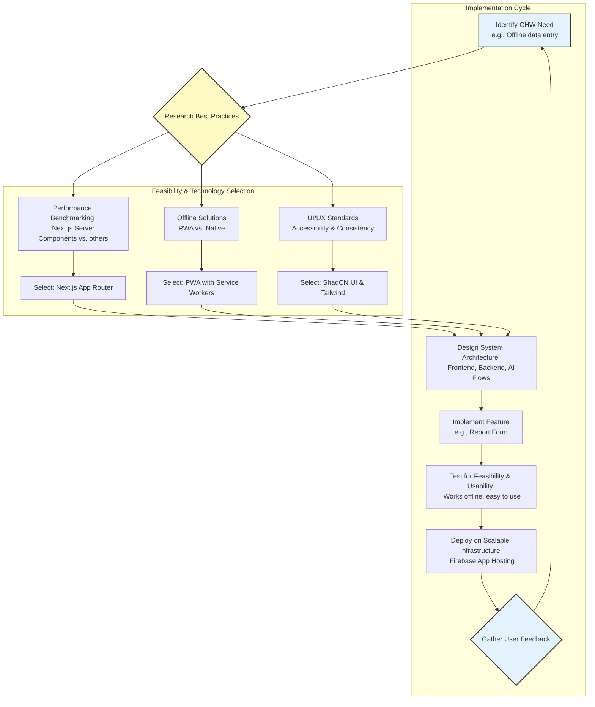

# Technical Approach: Smart Health Surveillance and Early Warning System

This document outlines the technical architecture and approach for the Swasthya Raksha application, a platform designed for the early detection and prevention of water-borne disease outbreaks.

## 1. Frontend

The user interface is a modern, responsive web application designed to be fast, accessible, and work effectively on both desktop and mobile devices, even in low-connectivity environments.

- **Framework:** **Next.js 15 (with App Router)** is used for its high-performance, server-first architecture. This allows for fast page loads and a smooth user experience. Server Components are used by default to minimize the amount of JavaScript sent to the client.
- **Language:** **TypeScript** is used for static typing, which improves code quality, maintainability, and developer productivity.
- **UI Components:** The application is built with **ShadCN UI**, a collection of accessible and composable components built on top of Radix UI and Tailwind CSS. This provides a consistent and professional look and feel.
- **Styling:** **Tailwind CSS** is used for all styling. It's a utility-first CSS framework that allows for rapid development of custom designs without writing custom CSS. The theme is centrally managed in `src/app/globals.css`.
- **Mobile & Offline Functionality:** The application is configured as a **Progressive Web App (PWA)** using the `@ducanh2912/next-pwa` package. This allows it to be "installed" on a user's home screen and caches the application assets for offline access, which is critical for health workers in remote areas.
- **Forms & Data Mutation:** Form handling is managed with **React Hook Form** for performance and validation, integrated with **Zod** for schema validation. Data is submitted securely to the backend using **Next.js Server Actions**, which eliminates the need to create separate API endpoints.

## 2. Backend

The backend is built directly into the Next.js application, leveraging its integrated server capabilities.

- **Runtime:** **Node.js** is the underlying runtime environment provided by Next.js.
- **Server Logic:** **Next.js Server Actions** serve as the primary backend logic handlers. They are secure, server-only functions that handle form submissions, database interactions (if any), and calls to the AI services. This simplifies the architecture by co-locating backend logic with the frontend components that use it.

## 3. AI and ML

The core of the predictive capability is powered by Google's Gemini models, accessed via the Genkit framework.

- **AI Framework:** **Genkit** is used to define, run, and manage the AI-powered workflows (called "flows"). It provides a structured way to create prompts, define input/output schemas, and orchestrate calls to generative models. The configuration is located in `src/ai/`.
- **Core Model:** **Gemini 2.5 Flash** (`gemini-2.5-flash`) is the default model used for the "outbreak prediction engine." It receives data from the CHW's report and is prompted to generate a structured JSON output containing:
    1.  A `riskScore` ('Low', 'Medium', 'High').
    2.  An array of `explainabilityFactors` (the top 3 reasons for the score).
    3.  A tailored, step-by-step `actionPlan` for the CHW.
- **Prompt Engineering:** The prompt, located in `src/ai/flows/generate-risk-score-and-explainability.ts`, is carefully engineered to instruct the AI to act as a public health expert and to return data in a specific, structured format using Zod schemas for output validation.

## 4. API Services

The application architecture minimizes the need for traditional REST or GraphQL APIs.

- **Internal API:** Communication between the frontend and backend is handled primarily through **Next.js Server Actions**, not explicit API routes. This is a more modern, secure, and efficient approach for full-stack applications.
- **External Services:** The only external API calls are made server-side from Genkit flows to the **Google AI (Gemini) API** for generative AI capabilities. API keys and other sensitive credentials are managed through environment variables.

## 5. Cloud Infrastructure

The application is designed to be deployed on modern, serverless cloud infrastructure for scalability and cost-efficiency.

- **Hosting:** The application is configured for deployment on **Firebase App Hosting**. App Hosting provides a fully managed, serverless environment with features like automatic scaling, global CDN, and integrated security. The configuration is defined in `apphosting.yaml`.
- **CI/CD:** While not explicitly implemented in the code, the setup is ready for a CI/CD pipeline (e.g., GitHub Actions) that would build the Next.js application and deploy it to Firebase App Hosting on every push to the main branch.

## 6. Research & Development Workflow Diagram

This diagram illustrates the iterative process of research, best practice implementation, and feasibility assessment used in the development of this application.

## 7. Add-ons & Future Enhancements

The current architecture is extensible and can support a wide range of future enhancements.

- **Database Integration:** For persistent storage of reports and user data, a database like **Firebase Firestore** could be easily integrated. Server Actions would be updated to write and read data from Firestore.
- **Authentication:** **Firebase Authentication** could be added to manage user accounts for CHWs and health officials, providing role-based access control.
- **Real-time Water Quality Monitoring:** The platform could be extended to receive data from **IoT sensors**. This would likely involve a separate service (e.g., Cloud Functions for Firebase) to ingest IoT data and store it in Firestore, which would then be visualized on the dashboard.
- **Push Notifications:** To provide real-time alerts, **Firebase Cloud Messaging (FCM)** could be implemented to send push notifications to users' devices when a high-risk prediction is made.
- **Advanced Analytics & Visualization:** The collected data could be streamed to **BigQuery** for advanced analytics and dashboarding with tools like **Looker Studio**, providing health departments with deeper insights into long-term trends.
- **Full Multilingual Support:** The placeholder for tribal languages can be built out with a full internationalization (i18n) library to manage translations across the entire application.
